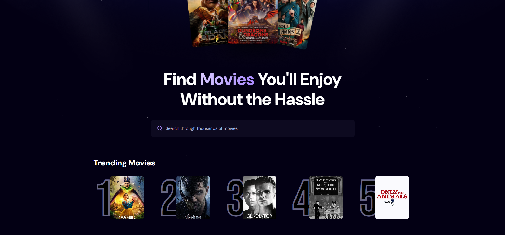

## 🎬 Movie App



A modern, responsive movie discovery experience powered by the TMDB API. Built with React and Vite, it lets users search through thousands of titles, see trending movies, and browse results in a clean, user-friendly interface.

---

## 🔗 Live Demo

👉 [View Deployed App](https://Rola-Al-Ahmad.github.io/React-Movie-App)

---

## 📋 Table of Contents

- [Project Overview](#-project-overview)
- [Features](#-features)
- [Tech Stack](#-tech-stack)
- [Project Structure](#-project-structure)
- [Getting Started](#-getting-started)
- [Available Scripts](#-available-scripts)
- [Key Features](#-key-features)
- [Components Overview](#-components-overview)
- [Data Structure](#-data-structure)
- [Routing](#-routing)
- [Styling](#-styling)
- [Contributing](#-contributing)
- [License](#-license)
- [Acknowledgments](#-acknowledgments)

---

## 🧠 Project Overview

Movie App is a **movie discovery experience** where users can search for titles, explore trending movies, and quickly decide what to watch.  
The project demonstrates a **clean React architecture** using debounced search for performance, integration with the **TMDB API** for rich movie data, and **Appwrite** for tracking trending search terms.  
Its primary learning goals are to showcase **real-world API integration**, **search UX patterns**, and a **production-style landing page** with loading states, error handling, and empty states.

## ✨ Features

### 🎯 Core Functionality

- **Movie Search Experience**: `App.jsx` orchestrates the hero section, search bar, trending list, and movie cards into a single-page experience.
- **Debounced Search**: User queries are debounced to avoid unnecessary TMDB API calls, providing a smooth search flow.
- **Trending Movies Section**: A dedicated "Trending Movies" row highlights the most popular titles fetched from Appwrite-backed search stats.
- **All Movies Grid**: Search results are rendered as movie cards with posters, titles, and core metadata.

### 🎨 User Experience

- **Hero Banner**: A cinematic hero image (`public/hero.png` / `public/hero-bg.png`) combined with a strong headline invites users to start searching.
- **Responsive Layout**: The layout adapts gracefully from mobile to desktop so the app feels native on any screen size.
- **Empty & Error States**: Clear feedback is shown when no movies are found or when an error occurs while fetching.
- **Loading Indicator**: A dedicated `Spinner` component provides visual feedback while data is being fetched.

### 🔧 Technical Features

- **TMDB Integration**: API requests are made against `https://api.themoviedb.org/3` using a bearer token stored in `VITE_TMDB_API_KEY`.
- **Appwrite Analytics**: `appwrite.js` tracks and reads trending searches so you can surface popular movies.
- **Debounce Hook**: `react-use`’s `useDebounce` is leveraged to optimize search.
- **Environment-based Config**: Sensitive API keys are read from environment variables via Vite.

---

## 🛠 Tech Stack

### Frontend

- **React (Vite template)** – Component-driven UI with hooks.
- **JavaScript (JSX)** – No TypeScript required; ideal for quick iteration.
- **Vite** – Fast dev server and optimized production builds.
- **CSS** – Global styling via `index.css` and component-specific styles in `App.css`.

### Backend / Services

- **TMDB API** – Provides movie data (titles, posters, popularity, etc.).
- **Appwrite** – Persists and aggregates search statistics for trending content.

### Tooling & Quality

- **ESLint (via Vite template)** – Basic linting for React and JS.
- **@vitejs/plugin-react** – Fast Refresh and JSX transform.

---

## 📁 Project Structure

`movie-app/`

- `public/`
  - `hero.png`
  - `hero-bg.png`
- `src/`
  - `assets/`
    - `thumbnail.png`
    - `react.svg`
  - `components/`
    - `MovieCard.jsx`
    - `Search.jsx`
    - `Spinner.jsx`
  - `App.css`
  - `App.jsx`
  - `appwrite.js`
  - `index.css`
  - `main.jsx`
- `package.json`
- `vite.config.*`
- `README.md`

---

## 🚀 Getting Started

### Prerequisites

- **Node.js 18+**
- **npm** (bundled with Node)

### Installation

1. **Clone the repository**

   ```bash
   git clone <repository-url>
   cd movie-app
   ```

2. **Install dependencies**

   ```bash
   npm install
   ```

3. **Create environment file**

   ```bash
   echo VITE_TMDB_API_KEY=your_tmdb_bearer_token_here >> .env.local
   ```

4. **Start the dev server**

   ```bash
   npm run dev
   ```

5. **Open the app**

   Visit `http://localhost:5173` in your browser.

---

## 📜 Available Scripts

| Script            | Description                         |
| ----------------- | ----------------------------------- |
| `npm run dev`     | Starts the Vite dev server          |
| `npm run build`   | Builds the app for production       |
| `npm run lint`    | Runs ESLint (if configured)         |
| `npm run preview` | Serves the production build locally |

---

## 🎯 Key Features

### 🏠 Hero & Search

- **Hero Headline** explaining the purpose of the app: quickly find movies you’ll enjoy.
- **Search Input** powered by the `Search` component and debounced queries in `App.jsx`.
- **Instant Feedback** for loading, errors, and empty results.

### 🔥 Trending & Results

- **Trending Movies Row** powered by `getTrendingMovies` from `appwrite.js`.
- **Movie Grid** rendered by mapping `movies` into `MovieCard` components.

### ⚙️ API & State

- **Centralized Fetch Logic** in `App.jsx` for both trending and search-based discovery.
- **Local Component State** for search term, debounced term, loading, errors, and movie lists.

---

## 🧩 Components Overview

- **`App.jsx`**: Main container that wires together search, trending, and movie grid sections.
- **`Search.jsx`**: Controlled input component that updates the current search term.
- **`MovieCard.jsx`**: Displays individual movie poster, title, and basic info.
- **`Spinner.jsx`**: Simple loading indicator for asynchronous operations.

---

## 📊 Data Structure

- **TMDB Responses**: Used directly to populate the `movies` state (`results` array).
- **Trending Movies**: Returned from Appwrite with fields like `$id`, `title`, and `poster_url`.
- **Environment Variables**: `VITE_TMDB_API_KEY` for API authentication.

---

## 🛣 Routing

- **Single-page layout**: No external router is required.
- All sections are rendered within `App.jsx`, relying on in-page scrolling.

---

## 🎨 Styling

- **Global Styles** in `index.css` define base typography, colors, and layout utilities.
- **App-specific Styles** in `App.css` provide hero, wrapper, pattern background, and section styling.
- **Responsive Layout** ensures the hero, trending row, and movie grid adapt to different screen sizes.

---

## 🤝 Contributing

1. **Fork** the repo.
2. **Create a feature branch**: `git checkout -b feature/amazing-feature`.
3. **Commit your changes**: `git commit -m "Add amazing feature"`.
4. **Push the branch**: `git push origin feature/amazing-feature`.
5. **Open a Pull Request** describing your updates.

### Code Style Guidelines

- Follow the existing ESLint rules from the Vite React template.
- Favor descriptive component and prop names.
- Keep components small and focused.
- Store shared helpers and API utilities under `src`.

---

## 📝 License

No explicit license has been provided yet. Add one (e.g., MIT) if you plan to distribute the project widely.

---

## 🙏 Acknowledgments

- **React + Vite** teams for the modern DX.
- **The Movie Database (TMDB)** for the movie data API.
- **Appwrite** for backend-as-a-service capabilities.
- **Design inspiration** from modern AI and media landing pages.

Movie App – Helping you discover movies you’ll actually enjoy.
